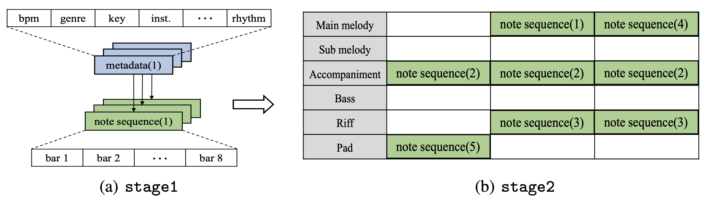

## Introduction

MusiComb is a work inspired by [Hyun et al. 2022](https://arxiv.org/abs/2211.09385), who introduce a dataset — dubbed *ComMU* — for the task of *combinatorial music generation*: given a set of short musical samples together with specific metadata describing their properties, combine them to create a complete piece of music. 

If the combined samples share a subset of the metadata — bpm, key, time signature, number of measures, genre, rhythm, and chord progression — the resulting composition is guaranteed to sound harmonious, independently of how the samples are arranged (still, some arrangements may sound more pleasant than others).

Hyun et al. divide the combinatorial music generation task in two stages:
- Stage 1: train a machine learning model on ComMU to generate new samples given the desired metadata
- Stage 2: combine the generated samples into a complete piece of music

However, they only focus on stage 1, i.e. they train a Transformer-XL ([Dai et al., 2019](https://arxiv.org/abs/1901.02860)) on ComMU and show the quality of the generated samples, leaving stage 2 for future work.

## Our contribution

That is where our work comes into play: the goal of MusiComb is to address stage 2 of the combinatorial music generation task. Specifically, MusiComb takes in input the desired shared metadata values, queries ComMU for a set of samples satisfying those requirements, and generates a complete musical composition by combining those samples. 

Under the hood, the sample arrangement task is modeled as a scheduling problem analogous to the [job shop problem](https://developers.google.com/optimization/scheduling/job_shop?hl=en) (as suggested in the figure above), where each "machine" represents a track role[^1] — main melody, accompaniment, riff, etc. In other words, MusiComb solves stage 2 of combinatorial music generation by only relying on constraint programming (CP) techniques.

### Sample generation

MusiComb was originally intended to work with samples extracted directly from the ComMU dataset, as described in the previous section. Nonetheless, as an extension of our initial work, we also incorporated Hyun et al.'s Transformer model into the generation pipeline, so that the final piece of music is the combination of samples which have themselves been generated.

Although this procedure more closely resembles the proposed formulation of combinatorial music generation, going beyond the finite (although huge) set of possible combinations of ComMU samples comes at a price: the generated samples tend to be more inconsistent in their quality than those contained in the dataset, resulting in a piece of music that not always pleases the ear. A more refined generative model may be the answer; we leave this further exploration for future work.[^2]

## Demo 1

Input:

|bpm|key|time signature|number of measures|genre|rhythm|chord progression|
|:---:|:---:|:---:|:---:|:---:|:---:|:---:|
|130|Am|4/4|8|new age|standard|Am-F-C-G-Am-F-C-G|

Output #1 (ComMU samples)[^3]:

<audio controls style="width: 400px;">
  <source src="assets/1a/tune.mp3" type="audio/mpeg">
</audio>

Output #2 (ComMU samples):

<audio controls style="width: 400px;">
  <source src="assets/1b/tune.mp3" type="audio/mpeg">
</audio>

Output #3 (generated samples):

<audio controls style="width: 400px;">
  <source src="assets/1c/tune.mp3" type="audio/mpeg">
</audio>

## Demo 2

Input:

|bpm|key|time signature|number of measures|genre|rhythm|chord progression|
|:---:|:---:|:---:|:---:|:---:|:---:|:---:|
|80|Am|4/4|8|cinematic|standard|Am-Gmaj7-Fmaj7-G-Cmaj7-Dm7-Am-A#maj7-E+-Am|

Output #1 (ComMU samples):

<audio controls style="width: 400px;">
  <source src="assets/2a/tune.mp3" type="audio/mpeg">
</audio>

Output #2 (ComMU samples):

<audio controls style="width: 400px;">
  <source src="assets/2b/tune.mp3" type="audio/mpeg">
</audio>

Output #3 (generated samples):

<audio controls style="width: 400px;">
  <source src="assets/2c/tune.mp3" type="audio/mpeg">
</audio>

## Demo 3

Input:

|bpm|key|time signature|number of measures|genre|rhythm|chord progression|
|:---:|:---:|:---:|:---:|:---:|:---:|:---:|
|120|Cmaj|4/4|8|cinematic|standard|C-F-Am-G|

Output #1 (ComMU samples):

<audio controls style="width: 400px;">
  <source src="assets/3a/tune.mp3" type="audio/mpeg">
</audio>

Output #2 (ComMU samples):

<audio controls style="width: 400px;">
  <source src="assets/3b/tune.mp3" type="audio/mpeg">
</audio>

Output #3 (generated samples):

<audio controls style="width: 400px;">
  <source src="assets/3c/tune.mp3" type="audio/mpeg">
</audio>

## Demo 4

Input:

|bpm|key|time signature|number of measures|genre|rhythm|chord progression|
|:---:|:---:|:---:|:---:|:---:|:---:|:---:|
|100|Cmaj|4/4|4|new age|standard|F-G-Em-Am-F-G-Em-Am|

Output #1 (ComMU samples):

<audio controls style="width: 400px;">
  <source src="assets/4a/tune.mp3" type="audio/mpeg">
</audio>

Output #2 (ComMU samples):

<audio controls style="width: 400px;">
  <source src="assets/4b/tune.mp3" type="audio/mpeg">
</audio>

Output #3 (generated samples):

<audio controls style="width: 400px;">
  <source src="assets/4c/tune.mp3" type="audio/mpeg">
</audio>

[^1]: *Track role* is one of the ComMU metadata. However, it is not among those that need to be shared for the harmonicity of the composition, as the final piece of music can (and should) be made of samples with different track roles. Therefore, it is not specified as an input to MusiComb.

[^2]: For example, it might be worth coming up with models specifically tailored to music structure, instead of relying on preexisting techniques developed for natural language. To be fair though, Hyun et al.'s model should probably be interpreted as a mean to showcase the dataset potential rather than a solution to the music generation task.

[^3]: This output and those that follow were obtained by converting the actual output of MusiComb (a MIDI file) to MP3 via GarageBand for macOS.

---
